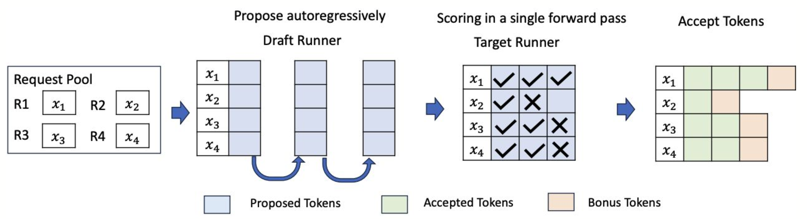

# SpecD (Speculative decoding)



Experimenting with speculative decoding using a small draft model and a larger target model.

## What is speculative decoding?

Paper Link : https://arxiv.org/abs/2211.17192

Speculative decoding is a text-generation technique where a smaller model proposes a few next tokens first, and a larger model then verifies them.

If the larger model agrees with the draft model often enough, you can generate multiple tokens per verification step and improve throughput. If agreement is low, the extra draft-model work can make generation slower instead.

In this repo:
- the draft model proposes tokens
- the target model verifies or corrects them
- benchmarks compare speculative decoding against normal vanilla generation

## Configuration

All main tunable settings live in `src/config.py`.

Current models are - 
DRAFT_MODEL_ID = "google/gemma-3-1b-it"
TARGET_MODEL_ID = "google/gemma-3-12b-it"


## Run with uv


```bash
uv sync
uv run specd --prompt "Explain transformers" --precision bf16
```

## Run the benchmark

```bash
uv run python -m src.bench --precision bf16 --prompt-limit 2
```
